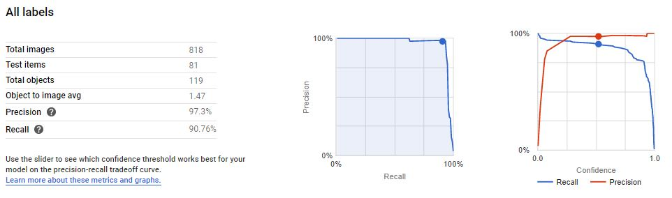
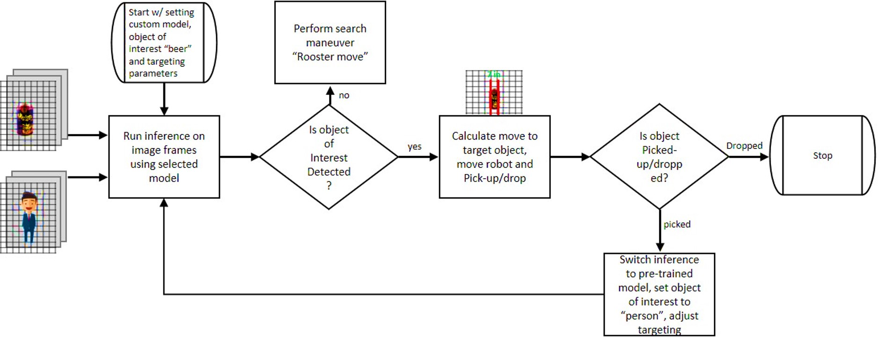

# **Robot "Getafix"**
My Tiny AI Robot that features edge computation, real-time object recognition using Raspberry pi 4B, Coral Edge TPU and Arduino.

## **Overview:**
Introducing one of my favorite pet projects that began with the humorous idea challenge, why not train a robot analog to a dog to fetch us a beer. Thus, the robot should be capable of detecting and recognizing beer bottles which is our object of interest, navigate to the bottle location and, be able to pick the bottle using a robot arm, then detect the person, locate, and carry it the person. This will need a combination of real-time object recognition using custom trained model, appropriate robot locomotion, navigation, robotic arm, power and the like. 

I called the first iteration robot that provides basic capabilities Getafix after the village druid character in [“The Adventures of Asterix”](https://en.wikipedia.org/wiki/Asterix). I am sharing the how’s and the design details in order to inspire interested roboteers and students with the application of Artificial Intelligence (AI or Tiny AI), real-time object recognition on edge computation using Raspberry Pi 4B, Google Coral Edge TPU and Arduino electronics. More importantly, the robot provides a combination of microprocessor, microcontroller, AI accelerator that is an Application Specific Integrated Circuit (ASIC) and peripheral electronics, that potentially can be used to assist disabled users or in industries to automatically identify, target and interact with any object, furthermore, it can be used as a development and testing bed for further innovative application of AI and robotics projects. can be used as a development and testing bed for further innovative application of AI and robotics projects. 

## **Robot Capabilities:**
* Locomotion, continuous tracks driven by two (x2) DC Motor with metal gearbox.
* Detect object of interest such as beer bottles, cans and cups from live camera live feed using deep learning Object-Recognition.
* Navigate to the object and pickup object and navigate back to starting point.
* Measure object distance using ultrasonic sensors.
* Gripper clamp robotic arm with two degrees of freedom.

## **Architecture/ How it all Connects:**

<table style="width: 676px;" border="1">
<tbody>
<tr>
<td style="width: 618.2px;" colspan="2">

<strong>Components and Specification:</strong>

</td>
<td style="width: 55.8px;">

<strong>Cost</strong>

</td>
</tr>
<tr>
<td style="width: 16px;">

1

</td>
<td style="width: 602.2px;">

Robot tank aluminum alloy chassis (SR14-B) with continuous tracks and drive two DC motor 33GB-520 DC6-12V 350 RPM

</td>
<td style="width: 55.8px;">

&nbsp;$33

</td>
</tr>
<tr>
<td style="width: 16px;">

2

</td>
<td style="width: 602.2px;">

CanaKit Raspberry Pi 4B 4GBRAM and 32GBmicroSD Starter Kit

</td>
<td style="width: 55.8px;">

&nbsp;$100

</td>
</tr>
<tr>
<td style="width: 16px;">

3

</td>
<td style="width: 602.2px;">

Camera Day &amp; Night Vision, IR-Cut Video Camera 1080p HD Webcam 5MP OV5647 Sensor for Raspberry Pi

</td>
<td style="width: 55.8px;">

&nbsp;$29

</td>
</tr>
<tr>
<td style="width: 16px;">

4

</td>
<td style="width: 602.2px;">

Heatsink Kit (x20pcs) Aluminum + Copper + 3M 8810 Thermal Conductive Adhesive Tape for Cooling Pi and Arduino electronics

</td>
<td style="width: 55.8px;">

&nbsp;$8

</td>
</tr>
<tr>
<td style="width: 16px;">

5

</td>
<td style="width: 602.2px;">

Cooling fan (included in Raspberry Pi Starter Kit)

</td>
<td style="width: 55.8px;">

-

</td>
</tr>
<tr>
<td style="width: 16px;">

6

</td>
<td style="width: 602.2px;">

Full Function Motor HAT, Robot Expansion Board Supports Stepper/Motor/Servo/IR Remote for Raspberry Pi 4B

</td>
<td style="width: 55.8px;">

&nbsp;$28

</td>
</tr>
<tr>
<td style="width: 16px;">

7

</td>
<td style="width: 602.2px;">

Coral USB Accelerator

</td>
<td style="width: 55.8px;">

&nbsp;$75

</td>
</tr>
<tr>
<td style="width: 16px;">

8

</td>
<td style="width: 602.2px;">

Arduino UNO R3 Complete Starter Kit

</td>
<td style="width: 55.8px;">

&nbsp;$40

</td>
</tr>
<tr>
<td style="width: 16px;">

9

</td>
<td style="width: 602.2px;">

High Speed SG5010 Digital Servo Motor (38g) for Arduino UNO (4pcs)

</td>
<td style="width: 55.8px;">

&nbsp;$24

</td>
</tr>
<tr>
<td style="width: 16px;">

10

</td>
<td style="width: 602.2px;">

Stepper motor 28byj-48 (include in the Arduino kit)

</td>
<td style="width: 55.8px;">

-

</td>
</tr>
<tr>
<td style="width: 16px;">

11

</td>
<td style="width: 602.2px;">

Adafruit Motor/Stepper/Servo Shield for Arduino v2.3 Kit

</td>
<td style="width: 55.8px;">

&nbsp;$19

</td>
</tr>
<tr>
<td style="width: 16px;">

12

</td>
<td style="width: 602.2px;">

Ultrasonic Sensor HC-SR04 (include in the Arduino kit)

</td>
<td style="width: 55.8px;">&nbsp;</td>
</tr>
<tr>
<td style="width: 16px;">

13

</td>
<td style="width: 602.2px;">

Power Supply Module 2.6V-5.5V 3A to 5V 2A Mini DC-DC Battery Booster USB Mobile Step-up Power Supply with Battery Indicator

</td>
<td style="width: 55.8px;">

&nbsp;$8

</td>
</tr>
<tr>
<td style="width: 16px;">

14

</td>
<td style="width: 602.2px;">

Adafruit PowerBoost 1000C Battery boost and Charger

</td>
<td style="width: 55.8px;">

&nbsp;$23

</td>
</tr>
<tr>
<td style="width: 16px;">

15

</td>
<td style="width: 602.2px;">

Charger PCB BMS Protection Board-18650 for Li-ion Lithium Battery Cell 1S 3.7V 4A (5pcs)

</td>
<td style="width: 55.8px;">

&nbsp;$8

</td>
</tr>
<tr>
<td style="width: 16px;">

16

</td>
<td style="width: 602.2px;">

Six (6P, 20100mAH total) LG MJ1 18650 3500mAh 3.6V Battery, (6pcs)

</td>
<td style="width: 55.8px;">

&nbsp;$38

</td>
</tr>
<tr>
<td style="width: 16px;">

17

</td>
<td style="width: 602.2px;">

USB-A to USB-C Cable 90 Degree Plug USB 3.0 Cable 0.8ft/0.25m

</td>
<td style="width: 55.8px;">

&nbsp;$8

</td>
</tr>
<tr>
<td style="width: 16px;">

18

</td>
<td style="width: 602.2px;">

USB-A to USB-B Cable 90 Degree Plug USB 2.0 Cable 0.5ft

</td>
<td style="width: 55.8px;">

&nbsp;$6

</td>
</tr>
<tr>
<td style="width: 16px;">

19

</td>
<td style="width: 602.2px;">

Angled USB C Cable Extension Gold Plated 90 Degree Type C to USB 3.0 Left Angle Male Adapter Data Sync Charging USB-C Cord (90°Type C-USB 3.0 A Left)

</td>
<td style="width: 55.8px;">

&nbsp;$9

</td>
</tr>
<tr>
<td style="width: 16px;">

20

</td>
<td style="width: 602.2px;">

One each 1KOhm and 2KOhm resistors (include in the Arduino kit)

</td>
<td style="width: 55.8px;">

-

</td>
</tr>
<tr>
<td style="width: 16px;">

21

</td>
<td style="width: 602.2px;">

104nF (x2 pcs) and 47nF (x4pcs) Ceramic Disc Capacitors (include in the Arduino kit)

</td>
<td style="width: 55.8px;">

-

</td>
</tr>
<tr>
<td style="width: 16px;">

22

</td>
<td style="width: 602.2px;">

Toggle switch DPDT

</td>
<td style="width: 55.8px;">

&nbsp;$10

</td>
</tr>
<tr>
<td style="width: 16px;">

23

</td>
<td style="width: 602.2px;">

0.7 and 0.5mm screws, nuts and washers set

</td>
<td style="width: 55.8px;">

&nbsp;$16

</td>
</tr>
<tr>
<td style="width: 16px;">

24

</td>
<td style="width: 602.2px;">

Motor Coupler 5mm with two screws and preferably flex fastener

</td>
<td style="width: 55.8px;">

&nbsp;$16

</td>
</tr>
<tr>
<td style="width: 16px;">

25

</td>
<td style="width: 602.2px;">

5mm aluminum tube

</td>
<td style="width: 55.8px;">

&nbsp;$5

</td>
</tr>
<tr>
<td style="width: 16px;">

26

</td>
<td style="width: 602.2px;">

PLA 1.75mm 3D printer filament

</td>
<td style="width: 55.8px;">

&nbsp;$20

</td>
</tr>
<tr>
<td style="width: 16px;">

27

</td>
<td style="width: 602.2px;">

3D printed stepper motor 28byj-48 mount support

(<a href="https://www.thingiverse.com/thing:3020621">https://www.thingiverse.com/thing:3020621</a>)

</td>
<td style="width: 55.8px;">

-

</td>
</tr>
<tr>
<td style="width: 16px;">

28

</td>
<td style="width: 602.2px;">

3D printed gripper clamp robot arm

(<a href="https://www.thingiverse.com/thing:2195839">https://www.thingiverse.com/thing:2195839</a>)

</td>
<td style="width: 55.8px;">

-

</td>
</tr>
<tr>
<td style="width: 16px;">

29

</td>
<td style="width: 602.2px;">

3D printed camera and ultrasound mount support

(<a href="https://www.thingiverse.com/thing:3476484">https://www.thingiverse.com/thing:3476484</a>)

</td>
<td style="width: 55.8px;">

-

</td>
</tr>
<tr>
<td style="width: 16px;">&nbsp;</td>
<td style="width: 602.2px;">

Total

</td>
<td style="width: 55.8px;">

&nbsp;$523

</td>
</tr>
</tbody>
</table>

## **Essential items and tools needed for the build:**
* Screw driver set
* Power drill
* 3D printer (I used my Prusa Mendel Iteration-2 (RepRap)
* Small color monitor with HDMI port, keyboard and mouse
* Vernier Calipers (preferably digital)
* Soldering Iron and Tin/Lead with rosin flux core
* Needle nose pliers with cutter
* Digital Multimeter
* MS VS Code
* MS VOTT
* Arduino Software (IDE)

## **Lesson Learned and Pain Points:**
* Stacking the boards vertically is the best option to use the space in the robot platform. 
* Use appropriate heat sinks and cooling fan to ensure efficient performance of the components.
* Use screws and bolts and zip locks as much as possible and minimize the use of glue when building your robot.
* Use snubber and protection circuits to avoid unnecessary noise interference or prevent failure of components. 
* Measure accurately and edit 3D model files as necessary before printing 3D objects.
* Labeling images is time taking and laborious.
* Update your Linux build and libraries including the Pi firmware.

## **Training the Object Detection Model:**
Data Collection; for this project, I used Google and Bing image search in order to get pictures of my favorite beer bottles and cans. Google Chrome extensions makes it easier to download and organize images, such as “Fatkun Batch Download Image” and “Image Downloader Continued”. 
Augmenting and Transforming Images, is an important technique to further enhance the training image data by performing basic transformation such as flipping/rotating, grayscale, blurring and injecting random noise into the images. I used this python code to perform the necessary image augmentation <will add link>.
Labeling the Images; Microsoft Visual Object Tagging Tool is one of the great tools that can be used to label images. Alternatively, Google Cloud AutoML Vision services for Custom Machine Learning Models can be used after uploading the images to Google Cloud Storage.  I used eight lables that include cups, water bottle and beers (jucifer, lagunita ipa, corona, guinness, heineken).I have uploaded sample dataset I used in training the custom model. <will add link>.

Training Model;  An easier way to perform custom object detection model training is to do transfer training using the MobileNet SDD model as detailed here https://coral.ai/docs/edgetpu/retrain-detection/#requirements. Alternatively, Google Cloud AutoML Vision services can be used to train TensorFlow lite models that works on the Coral edge TPU. 
Training Accuracy;

In addition to the custom object detection model this robotics project uses a pre-trained model on the COCO dataset to detect person in order to deliver the object of interest.

## **The Coding Fun:**
The basic concept is as outlined on the diagram below, first initialize by setting parameters that includes  the use of the custom object detection model to perform inference on the image frames from the camera, to detect the object of interest and obtain the corresponding  bounding box and object label, check the label of the object detected matches the object of interest that is for this robot version, is a specific type of beer say “Guinness”. If matched, calculate the dynamic horizontal target zone and the centroid of the detected object. Then determine if the object is to the left or right of the central horizontal target zone and, decide to actuate the robot main locomotion motors according to the direction of the target zone and distance of the object measured via the ultrasonic sensors.
The dynamic horizontal target zone is made out of two dynamic vertical lines that is a function of how far the object is from the robot, the target zone is wider for far detections and gets narrower as the object/robot gets closer. This targeting method makes it easier to align the robot from far and move it in place to pick the object using the robot arm. 

The object is picked when the object is within the horizontal target zone lines and the detected object distance is below the set minimum or the object detection bounding box frame width has reached the set maximum value. Then the robot is close enough to actuate the robot arm and pick up the object of interest. Once the object is picked the robot main code switches the object detection inference model to the pre-trained model and initializes the necessary parameters and, starts looking for the second object of interest that is a person in the room. And, similarly targets and moves to the person and drops the object close to the person. 

In case the robot could not detect or loses sight the objects of interest the robot main code executes a search maneuver which I call the “Rooster Move”, by moving forward and back and rotating side to side until it detects and locks on the object.
As shown in the above section “how things are connected” the robot arm is driven off the Arduino and SHIELD boards linked via serial USB cable to the Raspberry Pi. The robot locomotion is controlled by the Raspberry Pi HAT. One can control all motors and servos from the Arduino or the Pi depending on what you want to achieve or experiment. The robot main code communicates to the Arduino sketch code via serial interface and issues a set of commands defined in the sketch code 
<will add link to code> 

## **Future Upgrades:**
* Adapt the use of Robotic Operating System (ROS).
* Use wide angle view camera lens with fisheye correction.
* Use Accelerometer and Gyroscope sensor to identify the exact orientation and motion of the robot relative to the detected object of interest.
* Add infrared based distance sensor to increase accurately of distance measurement. 
* Grip sensor on the robot arm clamp.
* Current sink sensing to identify load on the servo’s and motor drives.
* Perfect the “Rooster Move” and add automatic obstacle avoidance system.
* Voice recognition to select object of interest or issue a voice command to the robot.

## **References:**
++++++++++UNDER CONSTRUCTION++++++++++

