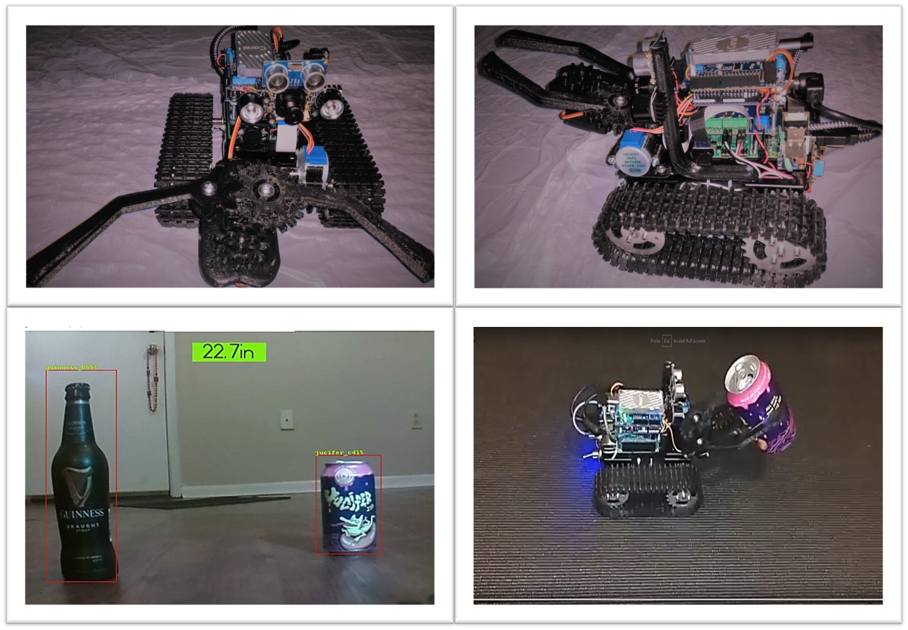
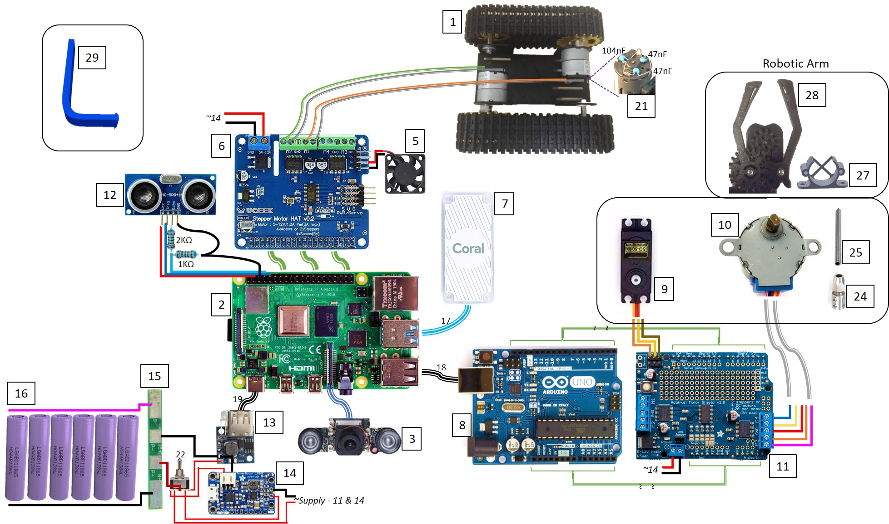

# **Robot "Getafix"**
Tiny AI Robot that features edge computation, real-time object recognition using Raspberry pi 4B, Coral Edge TPU and Arduino.

## **Overview:**
Introducing one of my favorite pet projects that began with the humorous idea challenge, why not train a robot analog to a dog to fetch us a beer. Thus, the robot should be capable of detecting and recognizing beer bottles which is our object of interest, navigate to the bottle location and, be able to pick the bottle using a robot arm and carry it back. This will need a combination of real-time object recognition using custom trained model, appropriate robot locomotion, navigation, robotic arm, power and the like. 
I called the first iteration robot that provides basic capabilities Getafix after the village druid character in “The Adventures of Asterix”. I am sharing the how’s and the design details in order to inspire interested roboteers and students with the application of Artificial Intelligence (AI or Tiny AI), real-time object recognition on edge computation using Raspberry Pi 4B, Google Coral Edge TPU and Arduino electronics. More importantly, the robot provides a combination of microprocessor, microcontroller, AI accelerator that is an Application Specific Integrated Circuit (ASIC) and peripheral electronics, that potentially can be used as a development and testing bed for further innovative application of AI and robotics. 

I called the first iteration robot that provides basic capabilities Getafix after the village druid character in [“The Adventures of Asterix”](https://en.wikipedia.org/wiki/Asterix). I am sharing the how’s and the design details in order to inspire interested roboteers and students with the application of Artificial Intelligence (AI or Tiny AI), real-time object recognition on edge computation using Raspberry Pi 4B, Google Coral Edge TPU and Arduino electronics. More importantly, the robot provides a combination of microprocessor, microcontroller, AI accelerator that is an Application Specific Integrated Circuit (ASIC) and peripheral electronics, that potentially can be used as a development and testing bed for further innovative application of AI and robotics. 

## **Robot Capabilities:**
* Locomotion, continuous tracks driven by two (x2) DC Motor with metal gearbox.
* Detect object of interest such as bottles and cups from live camera live feed using deep learning Object-Recognition.
* Navigate to the object and pickup object and navigate back to starting point.
* Measure distance object using ultrasonic sensors.
* Gripper clamp robotic arm with two degrees of freedom.

## **Architecture/ How it all Connects:**

